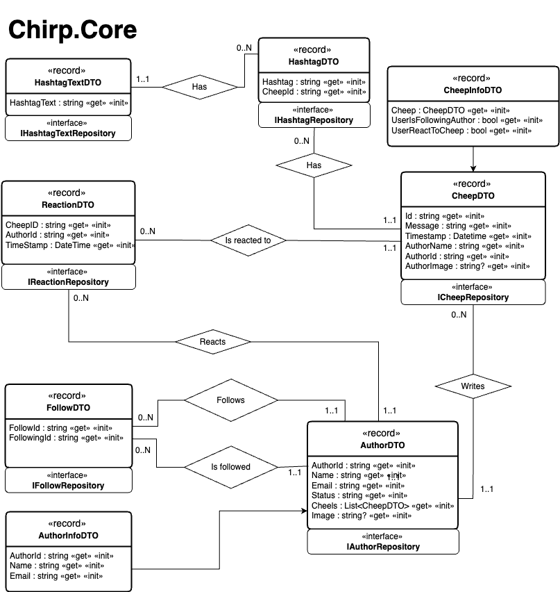
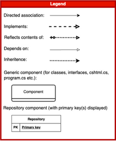
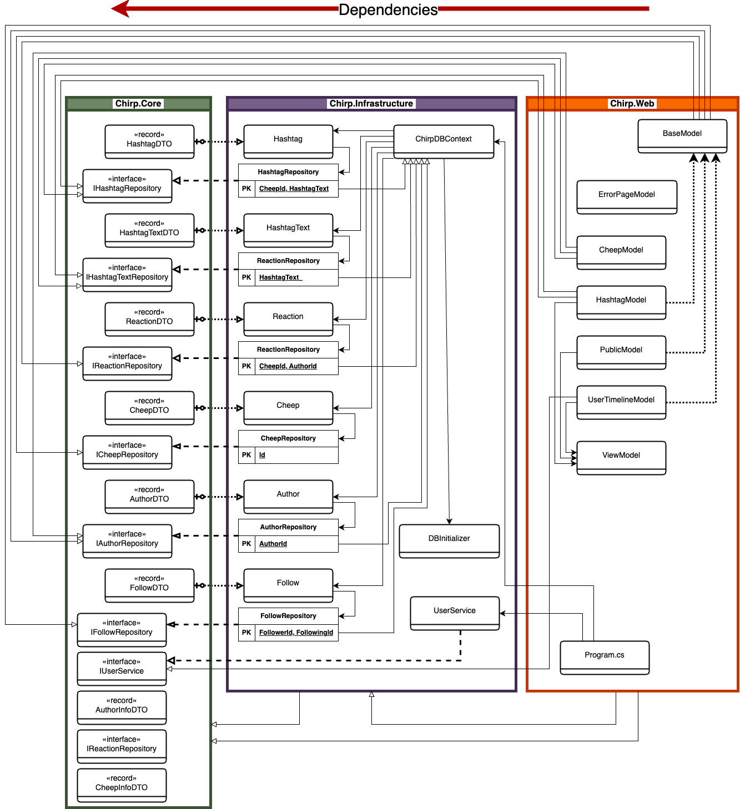
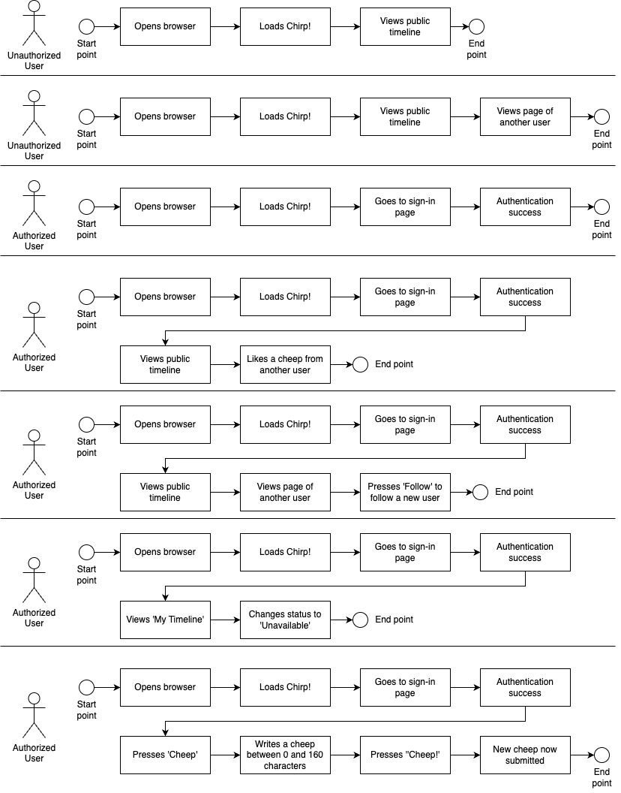
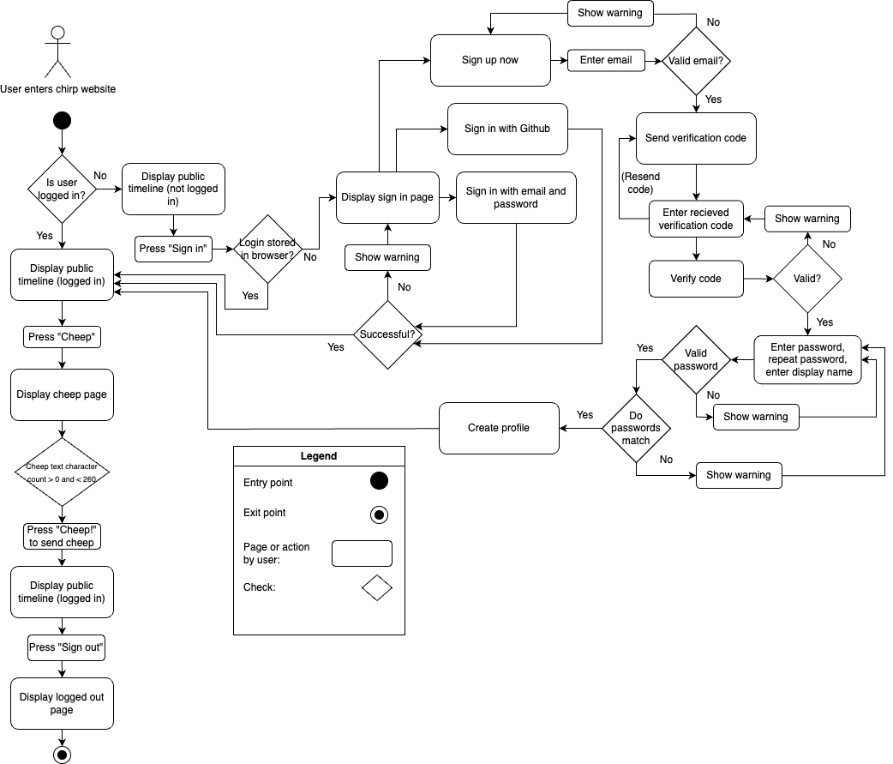
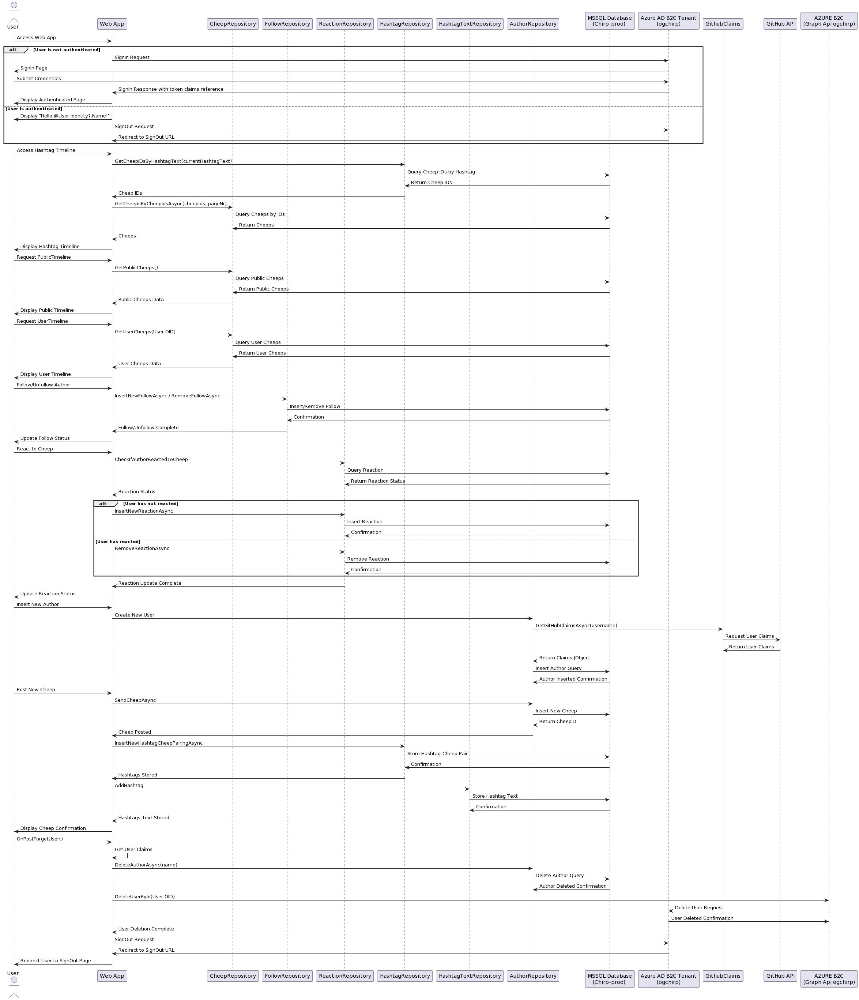
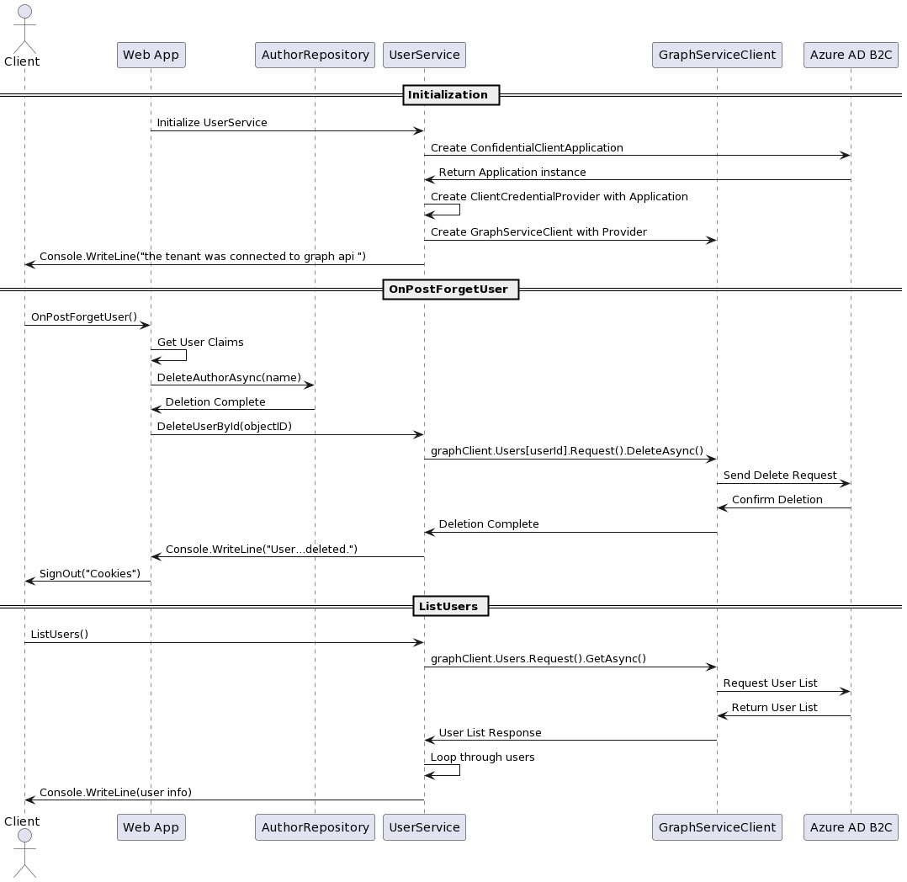
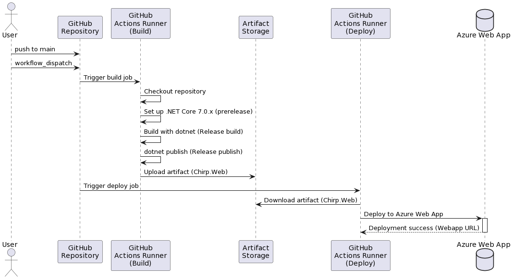
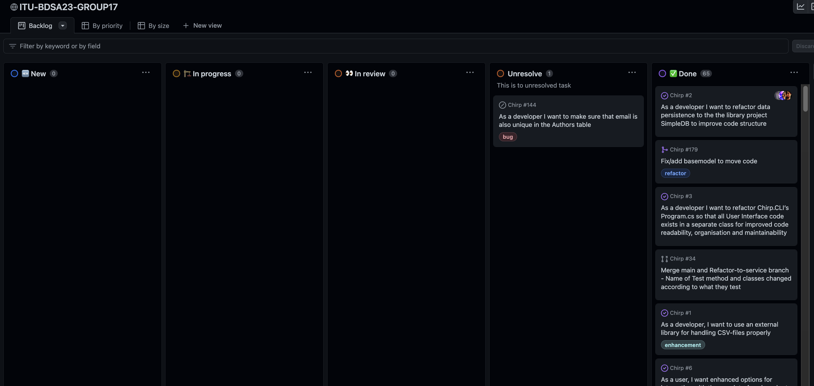
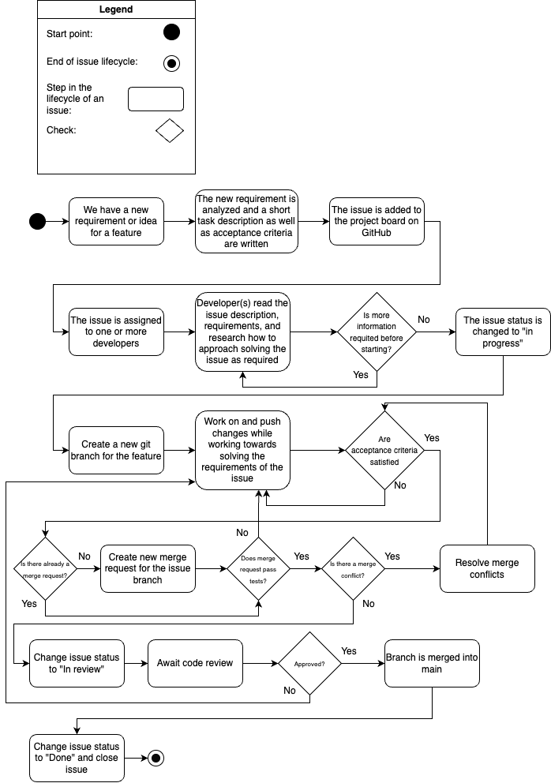

# BDSA GROUP 17 2023

## Course code: BSANDSA1KU

## Date: December 21, 2023

| Name                       | Email        | Date of Birth |
| -------------------------- | ------------ | ------------- |
| Burak Özdemir              | buoe@itu.dk  |               |
| Hanan Choudhary Hadayat    | abha@itu.dk  |               |
| Joshua James Medilo Calba  | jcal@itu.dk  |               |
| Julius Dalsgaard Bertelsen | jube@itu.dk  |               |
| Tan Dang                   | tanda@itu.dk |               |

## Design and architecture

### Domain model

<!--  -->

The domain model below reflects the entities and their relationship of the Chirp application, as well as the interfaces of the repositories that allow for accessing and manipulating these different entities and their related data. These entities form the foundation of the business logic of the application.

<div style="text-align: center; padding: 20px; background-color: white;">
    
</div>

<!-- Provide an illustration of your domain model.
Make sure that it is correct and complete.
In case you are using ASP.NET Identity, make sure to illustrate that accordingly. -->

### Architecture — In the small

The diagram below shows the organization of the code of the Chirp application, showcasing the relationships and dependencies of different components of the program, highlighting how the code of the program is organised into different layers of the onion architecture design.

At the centre of the onion architecture are the domain entities in Chirp.Core, as seen in the domain model shown above.

Surrounding the Core is first the Chirp.Infrastructure layer. This layer contains the implementations of the repository interfaces, and is responsible for actually handing mechanisms of data storage, access and manipulation connected to the core entities.

The Web layer surrounds these layers. It is responsible for the presentation of the application, handling the user interface and user interactions. The layer interacts with the core and infrastructure layers, using the domain entities and data access mechanisms to allow the user the interact with the business logic and data of the application.

The diagram shows how the Chirp application has been designed with an inward flow of dependencies in accordance with Onion architecture, so that the inner layers remain independent of external dependencies.

Some relationships have been omitted to improve the readability of the diagram.

<div style="text-align: center;">



</div>

<div style="text-align: center; padding: 20px; background-color: white;">



</div>

The figure below shows a more simplistic view of the onion architecture structure of the components of the application.


<!-- Illustrate the organization of your code base.
That is, illustrate which layers exist in your (onion) architecture.
Make sure to illustrate which part of your code is residing in which layer. -->

### Architecture of deployed application

The diagram below shows the interaction between the client component with a user interface allowing the user to make requests and the application deployed on Microsoft Azure as the server component.
The diagram also shows the interaction of this deployed application with the Azure SQL Database, as well as signing in through a social account (GitHub).

<!-- Illustrate the architecture of your deployed application.
Remember, you developed a client-server application.
Illustrate the server component and to where it is deployed, illustrate a client component, and show how these communicate with each other. -->

<!-- **OBS**: In case you ran out of credits for hosting an Azure SQL database and you switched back to deploying an application with in-process SQLite database, then do the following: -->

<!-- - Under this section, provide two diagrams, one that shows how _Chirp!_ was deployed with hosted database and one that shows how it is now again with SQLite.
- Under this section, provide a brief description of the reason for switching again to SQLite as database.
- In that description, provide a link to the commit hash in your GitHub repository that points to the latest version of your _Chirp!_ application with hosted database (we look at the entire history of your project, so we see that it was there at some point). -->

<div style="text-align: center; padding: 20px; background-color: white;">


</div>

### User activities

<!-- Illustrate typical scenarios of a user journey through your _Chirp!_ application.
That is, start illustrating the first page that is presented to a non-authorized user, illustrate what a non-authorized user can do with your _Chirp!_ application, and finally illustrate what a user can do after authentication.

Make sure that the illustrations are in line with the actual behavior of your application. -->

The diagram below shows a series of typical user activities through the Chirp application.
The diagram shows what a user may do while remaining unauthorized, and after logging in and becoming authorized.

<div style="text-align: center; padding: 20px; background-color: white;">



</div>
<br/>

Additionally, the diagram below shows a slightly more detailed view of possible scenarios of a user journey through Chirp, in which a user enters the chirp website, logs in, or creates a profile, if necessary, sends a cheep, and then logs out.

<div style="text-align: center; padding: 20px; background-color: white;">



</div>

### Sequence of functionality/calls trough _Chirp!_

<!-- With a UML sequence diagram, illustrate the flow of messages and data through your _Chirp!_ application.
Start with an HTTP request that is send by an unauthorized user to the root endpoint of your application and end with the completely rendered web-page that is returned to the user.

Make sure that your illustration is complete.
That is, likely for many of you there will be different kinds of "calls" and responses.
Some HTTP calls and responses, some calls and responses in C# and likely some more.
(Note the previous sentence is vague on purpose. I want that you create a complete illustration.) -->

The diagram below illustrates the flow of messages and data through the chirp application, starting with the sending of an HTTP request by an authorized user to the root endpoint of the application and ending with the completely rendered web-page that is returned to the user.
The diagram shows the different kinds of calls and the responses.

<div style="text-align: center; padding: 20px; background-color: white;">



</div>

Another diagram, this one shows .....

<div style="text-align: center; padding: 20px; background-color: white;">



</div>

## Process

### Build, test, release, and deployment

<!-- Illustrate with a UML activity diagram how your _Chirp!_ applications are build, tested, released, and deployed.
That is, illustrate the flow of activities in your respective GitHub Actions workflows.

Describe the illustration briefly, i.e., how your application is built, tested, released, and deployed. -->




<!--  -->


### Team work

<!-- Show a screenshot of your project board right before hand-in.
Briefly describe which tasks are still unresolved, i.e., which features are missing from your applications or which functionality is incomplete. -->

We have one unresolved task in our project board, which was make the email unique in the the Authors table, since there was a possibility that an Author could appear twice or more in the table with same name and email but with different id. The reason we did not resolve it is the low priority.

We were able to complete all the feature we want for our application. There were of course many feature we can implement, comment a cheep as well as share a cheep to name a few, but those were never in our original plan since we only focus on those feature we could make. 



<!-- Briefly describe and illustrate the flow of activities that happen from the new creation of an issue (task description), over development, etc. until a feature is finally merged into the `main` branch of your repository. -->

<div style="text-align: center; padding: 20px; background-color: white;">



</div>

### How to make _Chirp!_ work locally

<!-- There has to be some documentation on how to come from cloning your project to a running system.
That is, Rasmus or Helge have to know precisely what to do in which order.
Likely, it is best to describe how we clone your project, which commands we have to execute, and what we are supposed to see then. -->

Clone the repository using this git command

```bash
git clone https://github.com/ITU-BDSA23-GROUP17/Chirp/
```

Start the program using this command

```bash
cd src/Chirp.Web
dotnet run
```

After you run the command you can go to `https://localhost:7102` or `https://localhost:5273`

It will then open the browser and here you can interact with the application.
You can sign in by clicking on the top right corner with either your email or sign up with Github.

After you successfully sign in into the _Chirp!_ application you can now do one of the following feature we have implemented

- Sending a Cheep by clicking the blue box in the top right corner that says Cheep
- Delete your own Cheep
- Follow another user
- Unfollow a user you follow
- Go to another user and see their Cheeps only, by clicking on the name above their Cheep post
- Go to your timeline by clicking on the "My Timeline" in the navigation bar to see your information and your cheeps and in your profile you can

  - Set your status by choosing either online, offline or unavailable
  - Clicking on Forget, to remove yourself from the application

- Liking a Cheep by clicking on the thumbs up icon in a Cheep
- Removing a Cheep that you liked by clicking on the thumbs up icon
- When a Cheep has a # following a text, you can then click on the hashtag, it will then go to the hashtag page with all the Cheep that includes that hashtag, as well as displaying available hashtag that has been Cheeped. The order is descending by popularity.
- Sign out of the application

### How to run test suite locally

<!--
List all necessary steps that Rasmus or Helge have to perform to execute your test suites.
Here, you can assume that we already cloned your repository in the step above.

Briefly describe what kinds of tests you have in your test suites and what they are testing. -->

In the root folder run this command to test all the test

```bash
dotnet test
```

Make sure you have docker running in your machine

The following test have been implemented

#### Unit test

The unit tests are designed to test each individual component of our application by itself.

We have designed a series of unit tests to verify that our DTOs correctly encapsulate data. These tests confirm that each DTO retains and accurately represents the data passed to its constructor.

#### DTO Unit Tests

- `AuthorDTO_ShouldHoldProvidedValues`: Checks if the AuthorDTO object correctly assigns and retains the values provided.
- `CheepDTO_ShouldHoldProvidedValues`: Checks if the CheepDTO object correctly assigns and retains the values provided.
- `ReactionDTO_ShouldHoldProvidedValues`: Checks if the ReactionDTO object correctly assigns and retains the values provided.
- `HashtagDTO_ShouldHoldProvidedValues`: Checks if the HashtagDTO object correctly assigns and retains the values provided.

To run only the unit tests, use the following command in the root folder of the project:

```bash
dotnet test --filter Category=Unit
```

##### Integration test

The integration tests are designed to test how different parts of the application interacts with eachother. These tests involves instances of the database containers and checks if the application does the CRUD operations as expected.

##### CheepRepositoryTest

- `InsertCheepAsyncAddsCheepToDatabase`: Checks that cheeps are properly inserted into the database and are retrievable.

##### FollowRepositoryTest

- `GetFollowerIDsByAuthorIDAsync_ReturnsCorrectFollowerIDs`: Checks if the correct follower IDs are returned for a given author ID.
- `GetFollowingIDsByAuthorIDAsync_ReturnsCorrectFollowingIDs`: Checks if the correct following IDs are returned for a given follower ID.
- `InsertNewFollowAsync_InsertsFollowSuccessfully`: Checks that a new follow relationship is successfully inserted into the database.
- `RemoveFollowAsync_RemovesFollowSuccessfully`: Checks that a follow relationship is removed as expected.
- `GetFollowerCountByAuthorIDAsync_ReturnsCorrectCount`: Checks if the correct follower count is returned for an author.
- `GetFollowingCountByAuthorIDAsync_ReturnsCorrectCount`: Checks if the correct count of followings is returned for an author.

##### HashtagRepositoryTest

- `GetCheepIDsByHashtagText_GetsCheepIDsTiedToHashtag`: Checks if cheep ID's tied to a hashtag gets retrieved
- `InsertNewCheepHashtagPairingAsync_InsertsANewHashtagWithCorrectCheepIdAndHashtagText`: Checks if a new hashtag-cheep pairing is correctly inserted.
- `GetPopulalarHashtags_Returns10PopularHashtags`: Checks if the method returns the top 10 popular hashtags based on frequency.

##### HashtagTextRepositoryTest

- `AddHashtag_AddsHashtagToDatabase`: Checks if a new hashtag is added to the database.
- `AddHashtag_WillNotAddTheSameHashtagMoreThanOnce`: Checks that duplicate hashtags are not added to the database.
- `RemoveHashtag_RemovedSpecifiedHashtagTextIfItExist`: Checks if the specified hashtag text is removed from the database.

Make sure Docker is running as the tests rely on `Testcontainers.MsSql` to create a containerized MS SQL Server instance.

To run only the integration tests, use the following command in the root folder of the project:

```bash
dotnet test --filter Category=Integration
```

Note: As you may notice in our test folder we have more integration tests than unit tests. The reason is that unit test which is testing in the `Chirp.Core` package have only a few methods compared to the integration test, which is testing in the `Chirp.Infrastructure` package. Normally you have more unit test than integration test.

#### End to end test

## Ethics

### License

<!-- State which software license you chose for your application. -->

We chose to use the MIT license for our Chirp application, since it allows other developers to distribute, use and copy our software without imposing significant restrictions.

### LLMs, ChatGPT, CoPilot, and others

<!-- State which LLM(s) were used during development of your project.
In case you were not using any, just state so.
In case you were using an LLM to support your development, briefly describe when and how it was applied.
Reflect in writing to which degree the responses of the LLM were helpful.
Discuss briefly if application of LLMs sped up your development or if the contrary was the case. -->

Using LLMs has been both a advantage and disadvantage. Most of the time the code that was Generated by ChatGPT will not work according to what we wanted, and sometime give us more debug to do than if we google the problem ourselves. We use ChatGPT mostly for explaining errors or explaining the code, but few time using it for writing complex code that we were stuck in. 

With co-pilot we used it for error handling for our code, but it was quite minimal use. It has the feature to autocomplete our code when we write, but frequently the code it suggest is in no use, the only time it was been effective is when we need to write something that was repeating or very predictable, e.g. when we write insert methods in to our database in `DbInitializer.cs`.

In conclusion using LLM is a helpful tool to help simple task or understanding error. It is not applicable to use for complex task, but it's good for explaining code or analyzing errors in the code, overall it is just another addition for a developers toolbox.
